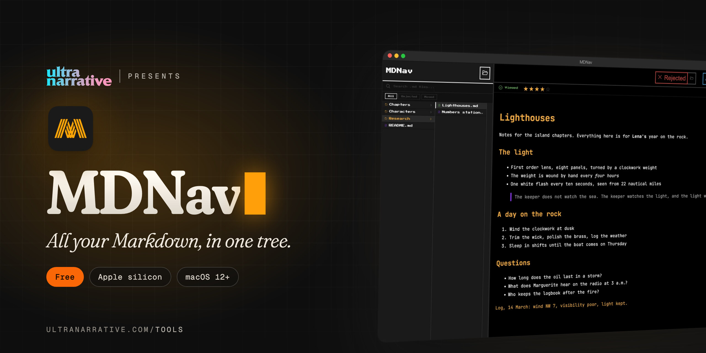

  

# MDNav

**All your Markdown, in one tree.**

*Dan Rodriguez · [UltraNarrative](https://www.ultranarrative.com) · [ultranarrative.com/tools](https://www.ultranarrative.com/tools) · [dan@ultranarrative.com](mailto:dan@ultranarrative.com) · October 2026*

---

Browse folders of Markdown files, read them rendered with one click, and open any of them in Warp with a double click.

Free, for a Mac with Apple silicon, macOS 12 or later. This repository holds the installer only. More free apps at [ultranarrative.com/tools](https://www.ultranarrative.com/tools).

## Download

[MDNav-mac-arm64.dmg](https://github.com/ultranarrative/mdnav-releases/releases/latest/download/MDNav-mac-arm64.dmg)

This link always points to the newest version.

## Opening it the first time

I sign MDNav myself rather than through Apple, so macOS asks once. Open the disk image, drag MDNav to Applications and open it. When macOS stops it, go to System Settings, then Privacy & Security, and click Open Anyway.

## Support

MDNav is free, with no account and no subscription. If it helps you, [buy me a coffee](https://ko-fi.com/danrsuarez).

Made by Dan Rodriguez at [UltraNarrative](https://ultranarrative.com). © 2026 UltraNarrative. All rights reserved.
